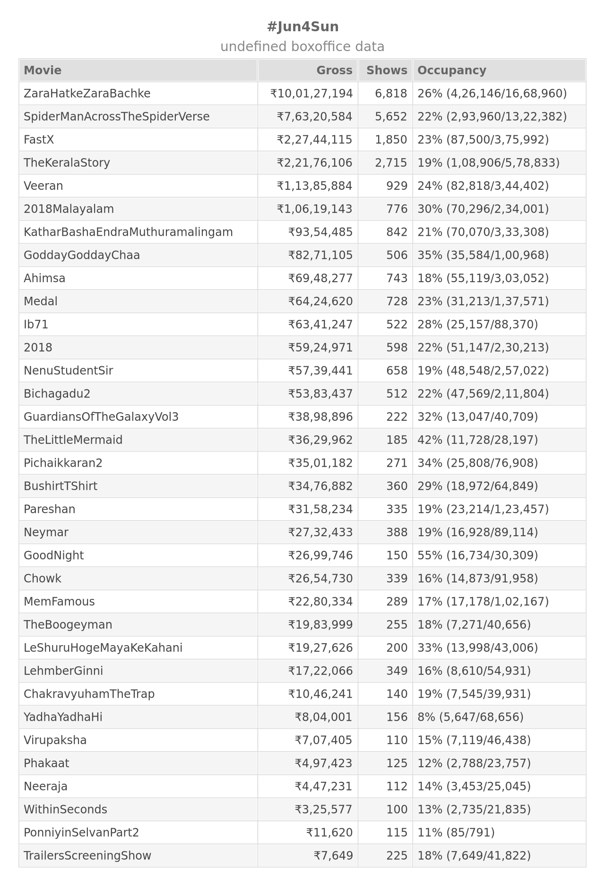

this will download/update both [rebrand.ly/bookmyshow](http://rebrand.ly/bookmyshow) & [rebrand.ly/paytm-movies](http://rebrand.ly/paytm-movies) into `store/dump` folder using git, using javascript & nedb for analysis

### how to use?

```
sudo apt-get install git node(>= v14)
cd <git_clone_path> && npm i
node report.js bms/ptm date/movie <YYYY-MM-DD>/<movieName>
```

example - `node report.js bms date 2023-06-04` will generate table img given below


