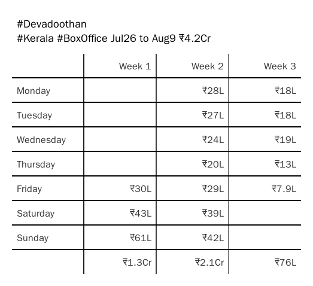

this will pull both [rebrand.ly/bookmyshow](http://rebrand.ly/bookmyshow) & [rebrand.ly/paytm-movies](http://rebrand.ly/paytm-movies) into `./store` folder using git

### how to use?

```
# install dependencies
sudo apt-get install git node(>= v14)
# clone this repository & install npm dependencies
cd <git_clone_path> && npm i
# generate report
node report.js bms/ptm date/movie <YYYY-MM-DD>/<movieName>
```

example cmd - `node report.js bms movie Kantara` will generate image table like given below


